# Procesverslag
**Auteur:** Carmen Rozendaal

## Bronnenlijst
1. bron 1: Pringles website, via https://www.pringles.com/nl/home.html. Geraadpleegd op 01-09-2020
2. bron 2: Markdown cheat cheet, via https://github.com/adam-p/markdown-here/wiki/Markdown-Cheatsheet
3. bron 3: W3 schools, via https://www.w3schools.com/

## Eindgesprek (week 7/8)

-dit ging goed & dit was lastig-

**Screenshot(s):**

-screenshot(s) van je eindresultaat-

## Voortgang 3 (week 6)

### Stand van zaken
Ik heb me de afgelopen week vooral gericht op het animeren van mijn website, hier was ik namelijk nog niet aan toe gekomen. 
Ik wist nog niet goed wat ik moest gaan doen dus ben ik gaan kijken welke micro-interacties er al waren en welke ik dan zou kunnen toepassen op mijn website.
Het hamburger-menu had ik al deels geanimeerd door een transitie eraan te geven waardoor die smooth in en uit schoof.
Ik wil nog wat gaan doen met het hamburgermenu-icoon, het is nu nog een plaatje. Dit ga ik nog mee aan de slag.

Waar ik nogmeer mee bezig ben geweest is de toegankelijkheid, ik heb pseudo classes gegeven aan mijn navigatie en aan de uitklapmenu's van de smaken. Ik had wel moeite met de class :active, deze werkte bij sommige elementen niet.

### Gesprek Marvin, studentassistent (05/10/2020)
Er waren nog een aantal andere dingetjes die nog niet zo lekker in elkaar zaten, daarom besloot ik om Marvin een berichtje te sturen via Teams of hij even met me mee wilde kijken naar mijn site en mijn code. We hebben een uurtje gezeten en het was erg nuttig. Hij heeft me geholpen met 

Ik ben me daarna gaan focussen op de Pringles-Bussen op de productenpagina, ik wilde dat ze meer zouden opvallen en er speelser uitzagen. Ik heb ze voor de grap op hun kop geplaatst wanneer je hier met je muis overheen hovert kantelen de bussen en worden ze vergroot waardoor ze goed leesbaar zijn. Dit geeft een gek maar leuk effect.

Op de detailpagina heb ik ook met de Pringles-Bus gespeeld, wanneer je nu met je muis hovert gaat de bus schudden. Net zoalang tot jij je muis er weer vanaf haald. Feit, dit kan je beter met je pringles bus niet doen want dan zijn al je pringles gebroken in 100 kleine stukjes ;)

### Wat ging goed?

## Voortgang 2 (week 5)

### Stand van zaken
Ik ben flink opgeschoten met mijn site, hij is nu geheel kloppend met het origineel. De Pringles-Bussen staan mooi op een rij, 
de teksten eronder kloppen nu ook, elementen zoals het logo zijn goed gepositioneerd, ik heb een hamburgermenu gecreeerd en ook zitten de smaken nu in aparte uitklapmenuutjes (Hier heb ik gebruik gemaakt van het element details>, dit plaatst content in een hokje en voegt daar een pointer aan toe). Ook heb ik gezorgt dat de site op het oog grotendeels responsive is.

Mijn focus ligt nu op het animeren van mijn site, hier moet ik alleen nog even over nadenken over hoe en wat ik precies wil doen. Ik heb een klein beginnetje gemaakt door wanneer je met de muis hovert over de pringles-bussen, ze op hun kop gaan staan, dit vond ik wel een leuk effect. Ik heb dit gedaan door in css :transform te gebruiken en de bus te schalen naar -1.

Wat vond ik lastig?
Waar ik soms nog wel erg mee zat te worstelen is dat je heel snel fouten maakt in je code waardoor dan ineens je hele site uit elkaar valt, ik heb dit de afgelopen week een paar keer gehad en dat zorgde voor een hoop paniek. Zo was er een a> element die geen afsluitings-haakje had of had ik een typfout gemaakt in de naam van mijn afbeelding waardoor die niet te zien was. Ik had ook geen back-up gemaakt. Ik heb hiervan geleerd om voortaan geconcentreerder bezig te zijn tijdens het coderen en voortaan mijn versies in een aparte map op te slaan.

Wat ik ook heb geleerd en eigenlijk erg gek vind, is dat wanneer ik mijn site op Github open op mijn telefoon, de Pringles-Bussen zijn uitgerekt. 
Maar wanneer ik op mijn desktop de inspector-tool gebruik en hem zet op telefoon, is er niks aan de hand. We dachten eerst dat het aan de height lag, die stond op auto en de ene stond in een a>. Maar nadat ik dit had aangepast was het op mijn telefoon niet onveranderd. Zo zie je maar dat niet alle browsers gelijk zijn en dit ook kan verschillen op devices.

**Screenshot(s):**

    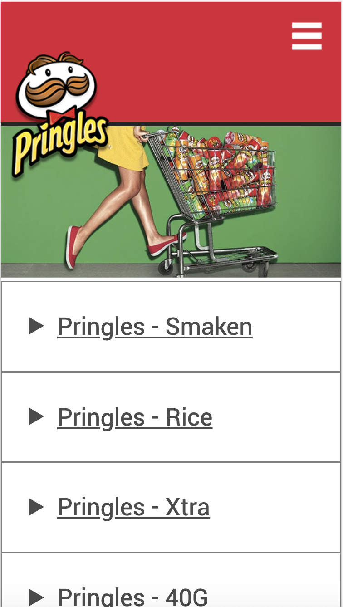
    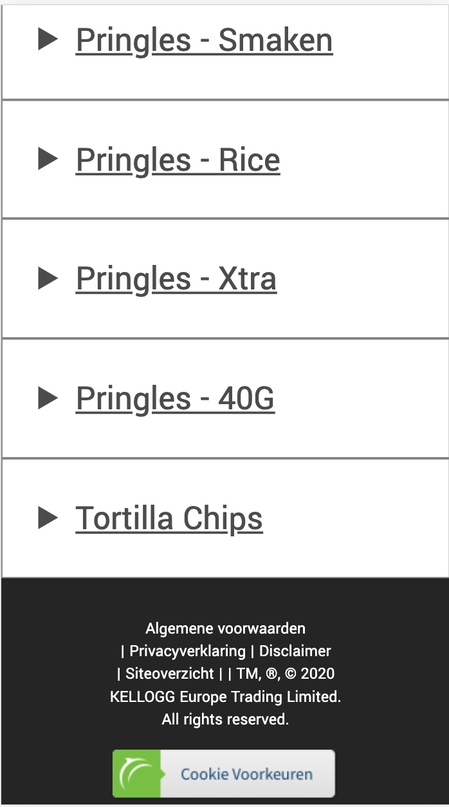

 
    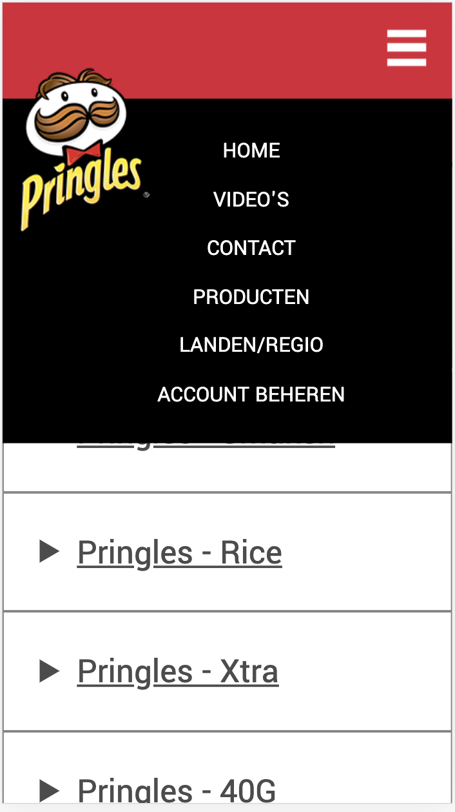
    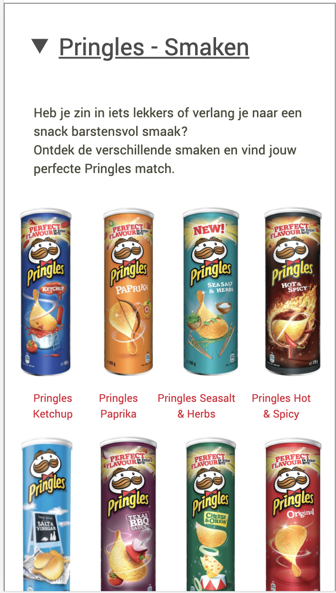

    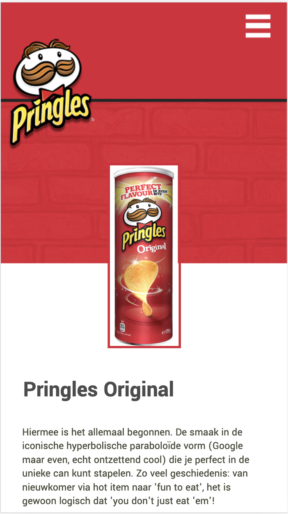
    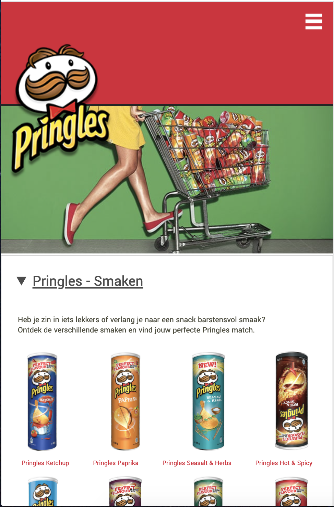

    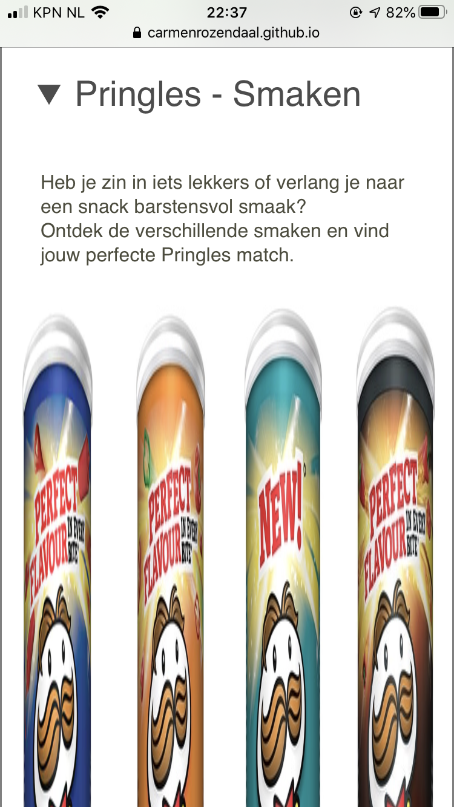

### Agenda voor meeting
1. Uitleg over de read-me, wat wordt er op het eind verwacht? 
2. Hoe ver moet je met surface gaan, is er een minimaal aan animaties? 
3. Eigen ding: Advies. beter animeren in css of javascript?
4. Eigen ding: Zijn er nog andere handige sites die ik kan gebruiken betreft code opzoeken? 

### Verslag van meeting
Het voortgangsgesprek met de studentassistenten Marvin en Nathan waren erg nuttig. Ik heb meer uitleg gekregen over hoe de readme moet worden geschreven en wat er eigenlijk van wordt verwacht. Ze vonden die van mij al erg goed alleen waren mijn foto's wel erg groot, hier kreeg ik de tip voor om deze te verkleinen, ik wist zelf niet dat dit kon dus dat was erg handig. Verder had ik nog wat vragen gesteld betreft de Surfaceplane en kwam er daardoor achter dat Javascript een must was bij de animaties en het vooral gaat om micro-interacties. Dit houdt in dat ik me moet focussen op het leuker maken van de site maar ook dat het dus een toevoeging heeft voor de gebruiker. Dit was handig om te weten want daardoor heb ik nu meer een beeld wat er van me wordt verwacht en kan ik me daar de rest van de weken op richten.

## Voortgang 1 (week 3)

### Stand van zaken
Ik ben deze week aan de slag gegaan met position> en flexbox> en heb ik een begin gemaakt aan het toepassen van javascript op de navigatie. 

Ik ben begonnen met het logo te positioneren op de goede plek, dit was nog best lastig aangezien daardoor alles ging verschuiven. Ik heb mijn klasgenoot Danny uiteindelijk om hulp gevraagd aangezien hij in zijn Lays-site hetzelfde principe moest doen met het logo.

Vervolgens ben ik de producten met bijbehorende titels op een rij gaan zetten door flexbox> te gebruiken. Dit ging ook niet gelijk goed. De producten werden heel erg klein en waren niet gelijk in grootte, deze heb ik in Photoshop gelijk moeten trekken omdat de uitsnede van de originele foto's niet goed bleek te zijn.
Ook had ik in html alle producten achter elkaar gezet in een list>, dit bleek niet de beste oplossing dus heb ik inplaats daarvan de producten per rij in een list> gezet. Dit werkte goed en nu staan ook alle producten op een rij, alleen de tekst werkt niet goed mee... Bij de footer heb ik ook flexbox> gebruikt.

Tot slot heb ik voor de navigatie ook nog flexbox> gebruikt zodat de elementen op een rij bovenaan de pagina kwamen te staan, vervolgens heb ik het hamburger icoontje toegevoegd door gebruik te maken van position> Javascript is me helaas niet gelukt deze week.

**Screenshot(s):**

    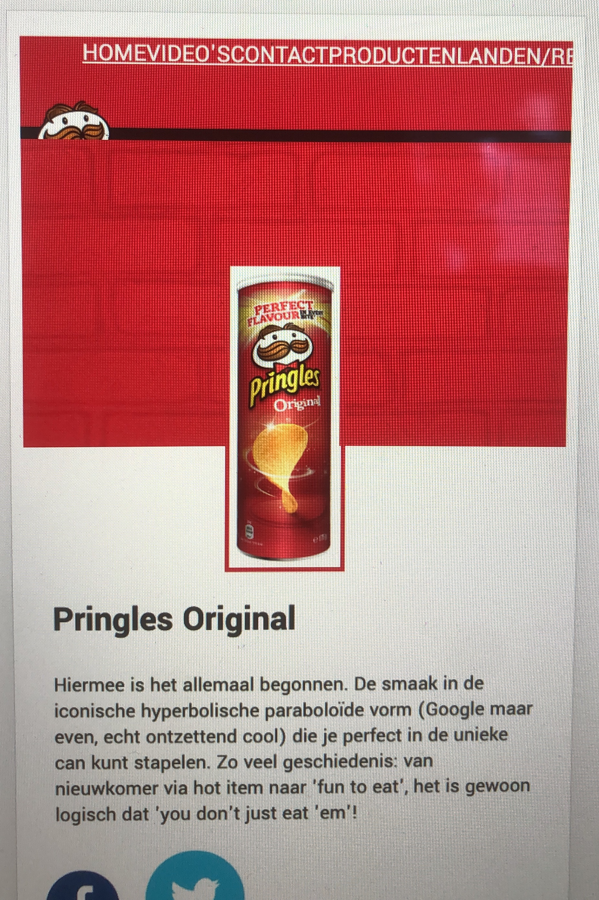
    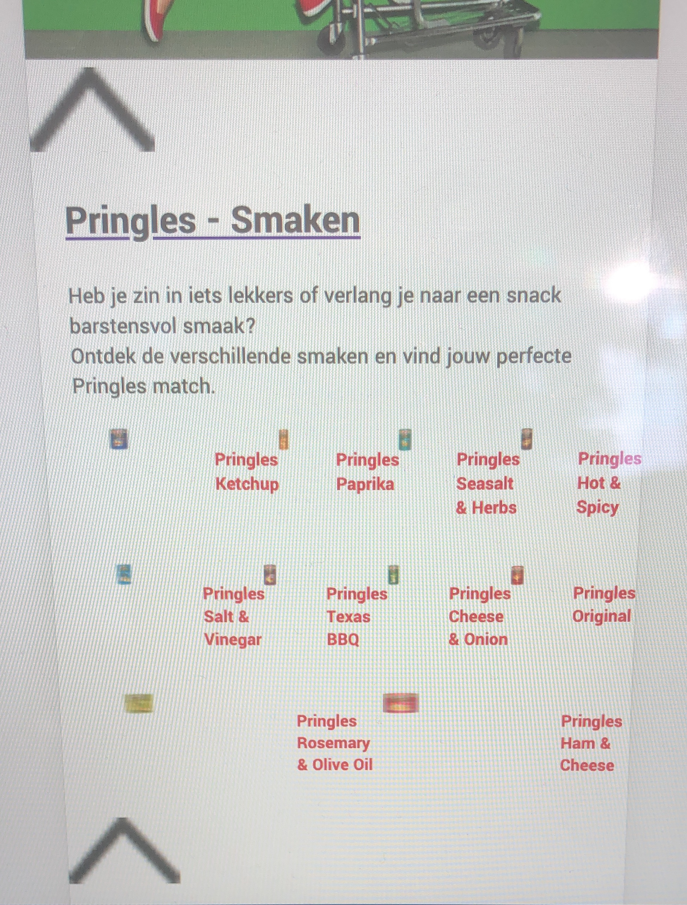

    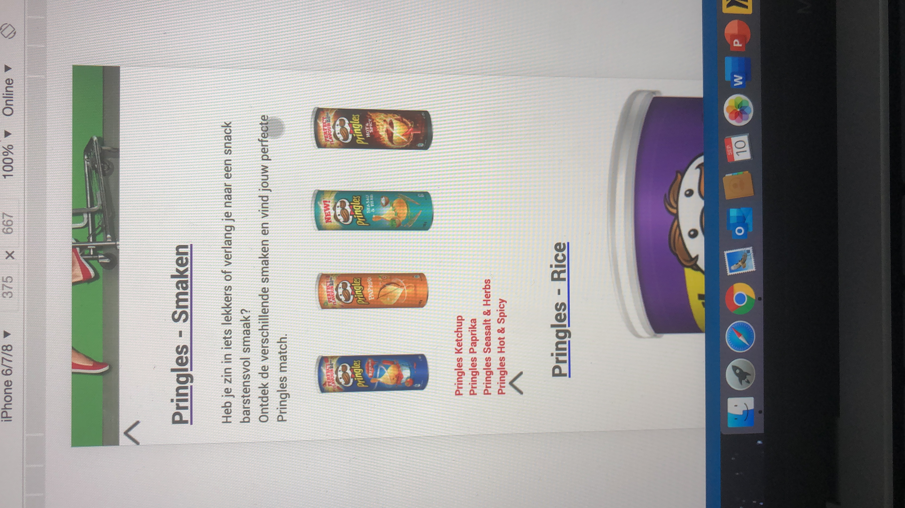
    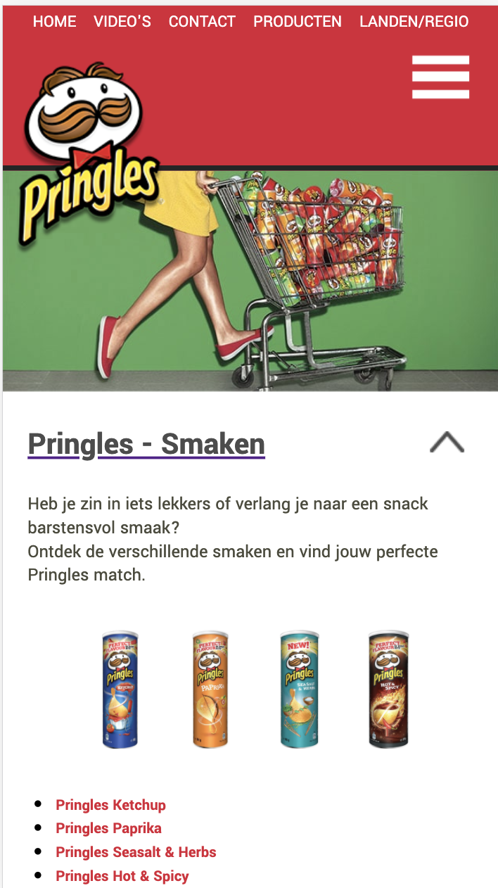

### Agenda voor meeting
1. Navigatiemenu Hamburger 'uiklappen' -> Pijltjes uitklapbalk 
2. Flexbox toepassen op tekst onder afbeelding. 
3. Icoontjes in navigatiebalk
4. eigen issues: Pringles Cans + tekst beter centreren 
5. eigen issue: Logo + Cans + tekst schalen en responsive 

### Verslag van meeting
Ik heb veel gehad aan het voortgangsgesprek omdat ik hierdoor verder ben gekomen met mijn site. Ik heb door middel van flexbox de pringles bussen en de tekst nu naast elkaar gekregen, ook staan ze door gebruik van justify-content gecentreerd. Verder heb ik uitleg gekregen over hoe ik het hamburgermenu en de uitklapmenu'tjes bij de smaken, moest maken. Ik had in mijn html nog veel classes staan en ook maakte ik veel gebruik van sections, hier kreeg ik de tip voor om daar nog even naar te kijken of ik die wel echt nodig had.

## Proces (Week 2)
Ik ben deze week aan de slag gegaan met het plaatsen van alle content in de html en het toepassen van css op de tekst. Ook heb ik alvast een klein stukje layout gedaan.

Wat ging goed?
Ondansk dat ik het lastig vond om de code van de site te lezen, kon ik alle content goed verzamalen en plaatsen. Het scheelde dat ik de basisvaardigheden van html/css nog wist. Ik was achteraf best tevreden over het resultaat.

Wat ging minder goed?
Het lettertype dat door Pringles wordt gebruikt is een betaald lettertype, ik heb daarom een soortgelijk lettertype moeten zoeken op GoogleFonts/Dafont, dit koste wat tijd. Er stonden behoorlijk wat producten op de pagina en deze waren allemaal verschillend qwa grootte, dit was beetje vervelend betreft layout.

**Screenshot(s):**

    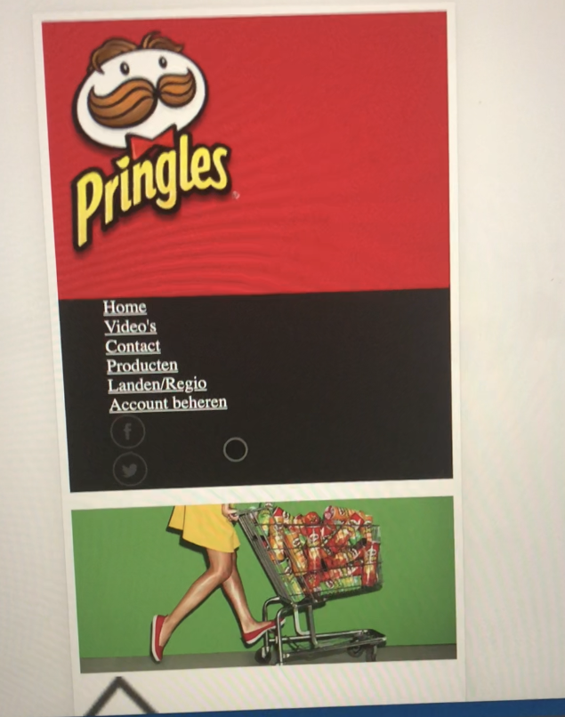
    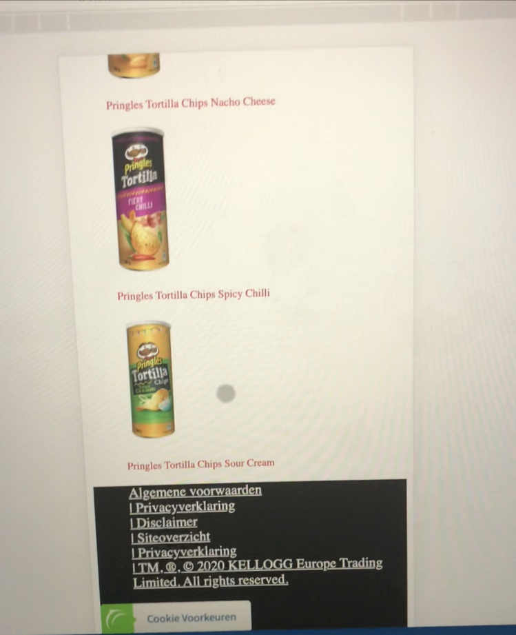
    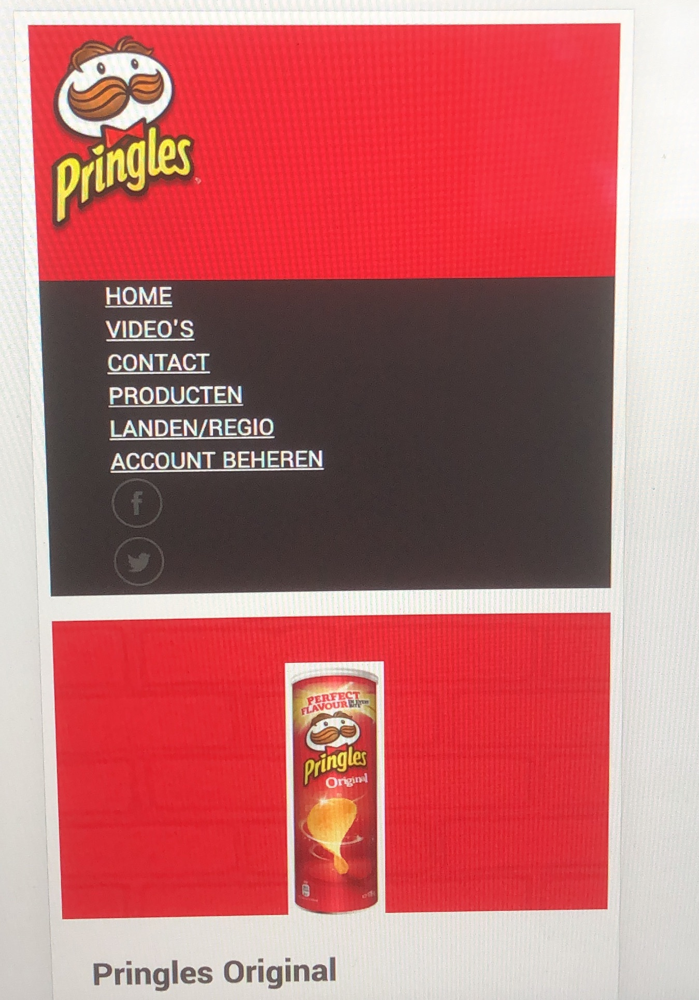

**Vimeo link naar video resultaat week 2:** https://vimeo.com/458704175/c16d242628)

## Intake (week 1)

**Je startniveau:** Blauw

**Je focus:** Surface plane

**Je opdracht:** https://www.pringles.com/nl/home.html

* Ik heb voor Pringles gekozen omdat ik een echte chips-liefhebber ben, verder is het een leuk onderwerp om de komende tijd aan te werken.

* De huidige site van Pringles is nodig toe aan verbetering omdat hij niet zo van deze tijd is, zo bevat het weinig animaties en is er niet veel gedaan aan de vormgeving. Ik wil leren hoe je o.a interacties kunt toepassen op een site dus daarom was de site van Pringles erg geschikt. 

**Screenshot(s) huidige pagina's:**

    
    

    
    

**Breakdown-schets(en):**
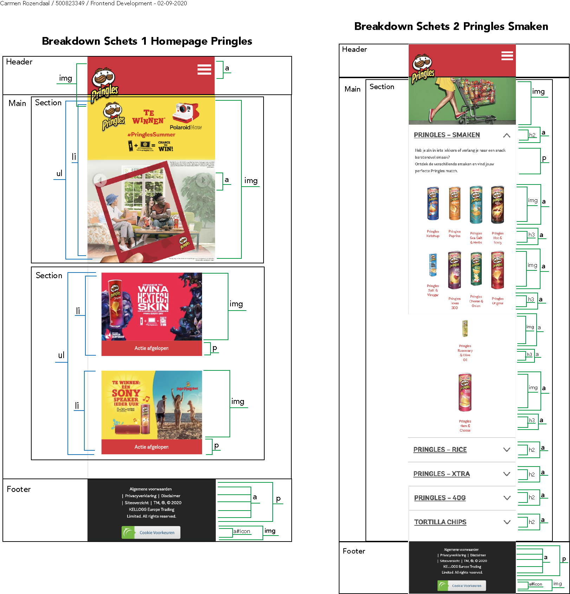
