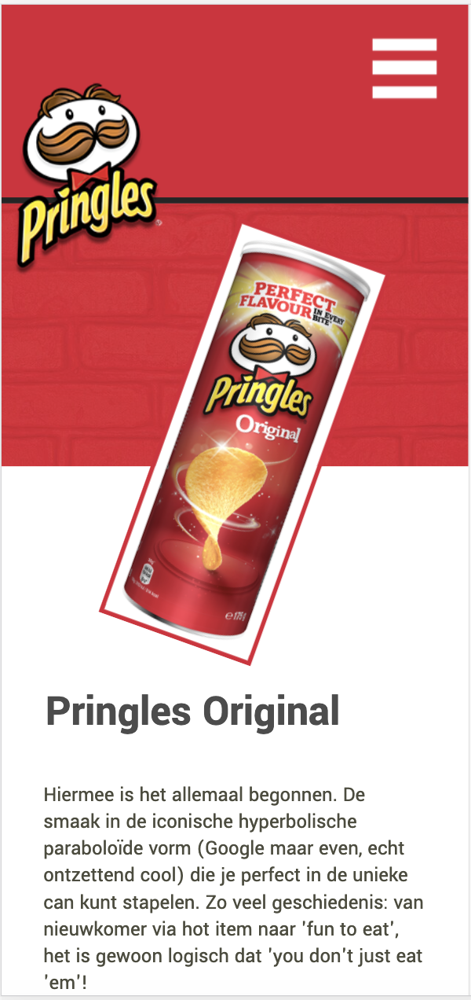
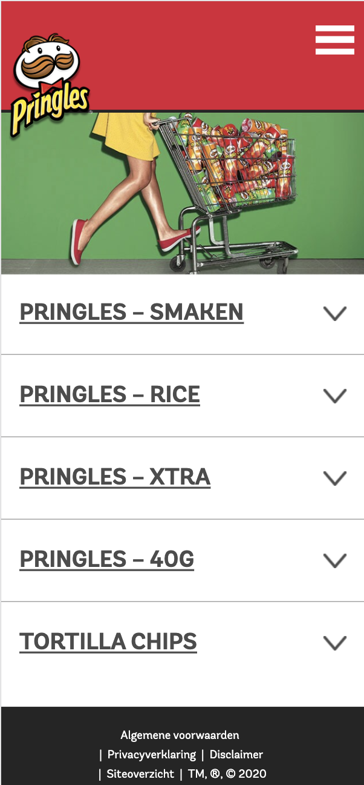

# Procesverslag
**Auteur:** Carmen Rozendaal

## Bronnenlijst
1. bron 1: Pringles website, via https://www.pringles.com/nl/home.html. Geraadpleegd op 01-09-2020
2. bron 2: Markdown cheat cheet, via https://github.com/adam-p/markdown-here/wiki/Markdown-Cheatsheet
3. bron 3: W3 schools, via https://www.w3schools.com/

## Eindgesprek (week 7/8)
Ik ben de laatste weken nog lekker aan de slag gegaan met mijn site. Ik heb de feedback die ik bij het voortgangsgesprek had ontvangen doorgevoerd, zo heb ik nu meerdere animatie gemaakt op mijn detailpagina. Ik heb bij de animatie o.a geexperiementeerd met het combineren van 2 Keyframes, het toevoegen van geluid en het gebruik van Javascript. Ook heb ik me bezig gehouden met de puntjes op de i betreft toegankelijkheid, ik heb hoverstates/focusstates en activestates toegepast gecheckt of alle afbeeldingen voorzien waren van een alt-text. Verder heb ik gezorgd dat de site nu meer responsive is van mobiel tot desktop.

### Wat ging goed?
Het was makkelijk om de huidige huisstijl van Pringles goed door te voeren in de site. Em wanneer je eenmaal weer doorhebt hoe html/css/javascript werkt, gaat het wel vlot. Verder ben ik erg tevreden over het eindresultaat, ik vind het een mooi re-design geworden en vind het een verbetering met het origineel. 

### Wat ging minder?
Ik had wat problemen met het pad naar een image toe, hierdoor had ik dan foutmeldingen of werkte de interactie niet. Dit heb ik dan ook in het channel moeten vragen aan de studentassistentes en die hielpen me goed. Wat ook wel lastig was, was het gebruik van classes verminderen, ik was dit namelijk erg gewend vanuit internetstandaarden en inleiding programeren. 

Bijna alle dingen die ik wilde doen betreft het ontwerp in de site, zijn gelukt. Het enige jammere is dat het geluid van de animatie niet afspeeld wanneer ik de site laad op mijn telefoon, de animatie beweegd wel zoals die hoort. Op Desktop werkt dit allemaal weer wel, ik heb niet kunnen achterhalen waar de fout zit.

**Screenshot(s):**

    
    

    
    

    
    

    
    

    
    

## Voortgang 3 (week 6)

### Stand van zaken
Ik heb me de afgelopen week vooral gericht op het animeren van mijn website, hier was ik namelijk nog niet aan toe gekomen. 
Ik wist nog niet goed wat ik moest gaan doen dus ben ik gaan kijken welke micro-interacties er al waren en welke ik dan zou kunnen toepassen op mijn website.
Het hamburger-menu had ik al deels geanimeerd door een transitie eraan te geven waardoor die smooth in en uit schoof.
Ik wil nog wat gaan doen met het hamburgermenu-icoon, het is nu nog een plaatje. Hier ga ik nog mee aan de slag.

Waar ik nog meer mee bezig ben geweest is de toegankelijkheid, ik heb pseudo-classes gegeven aan mijn navigatie en aan de uitklapmenu's van de smaken. Ik had wel moeite met de class :active, deze werkte bij sommige elementen niet en ook had de browser een standaard :focus class die ik eigenlijk best irritant vond.

### Gesprek Marvin, studentassistent (05/10/2020)
Er waren nog een aantal andere dingetjes die nog niet zo lekker in elkaar zaten aan mijn site, daarom besloot ik om Marvin een berichtje te sturen via Teams of hij even met me mee wilde kijken naar mijn site en mijn code. We hebben een uurtje gezeten en het was erg nuttig en gezellig. Hij heeft me advies gegeven over wat ik zou kunnen animeren, me aangeraden om de Pringles-bussen met de titels in een grid te zetten ipv flexbox en verder wat kleine bugs opgelost.

### Na het gesprek
Ik heb Grid toegepast op de Pringles-Bussen met de bijbehorende titels en dat werkt inderdaad veel beter. Ook is mijn site nu meer responsive wat het geheel ook functioneler maakt. Ik heb de articles vervangen voor sections en snap nu beter het verschil.

Daarna ben ik me gaan focussen op de micro-interacties, zo heb ik de Pringles-Bussen op de productenpagina aangepakt. Ik wilde dat ze meer zouden opvallen en er speelser uitzagen. Ik heb ze daarom voor de grap op hun kop geplaatst en wanneer je hier met je muis overheen hovert, kantelen de bussen en worden ze vergroot. Dit geeft een leuk effect.

Op de detailpagina heb ik ook met de Pringles-Bus gespeeld, wanneer je nu met je muis hovert gaat de bus schudden. Net zolang tot jij je muis er weer vanaf haald. Feit, dit kan je beter niet met je Pringles bus doen want dan zijn al je Pringles gebroken in 100 kleine stukjes ;)

### Wat ging goed?
De site is al kloppend met het orgineel en ook bijna af. Het is nu een kwestie van het toevoegen van de details en mijn eigen invulling eraan te geven. Het animeren ging erg vlot en is erg leuk om mee bezig te zijn. Doordat ik nu ook Grid heb toegepast op mijn site heb ik nu meer kennis gekregen van de verschillende onderdelen. Ook is mijn site nu goed te gebruiken op mijn mobiel.

### Wat ging minder?
Het nadeel van coderen vind ik nogsteeds dat wanneer er een klein foutje is of er iets veranderd, andere verschuiven of er niks gebeurd. Het werken aan mijn site duurde daarom soms langer dat nodig was, waardoor ik met andere vakken in de knoop kwam. Maar desondanks ben ik nogsteeds erg tevreden met het resultaat en het proces dat ik tijdens deze opdracht heb doorlopen.

**Screenshot(s):**

    
    

    
    

### Agenda voor meeting
1. Hamburger icoon is niet selecteerdbaar met de tab-toets, de items wel wanneer je deze uitklapt.
2. Hoe maak je een hamburger-icoontje (dus 3 streepjes ) met html/css die je kan animeren? 
3. Met @keyframes een plaatje zowel roteren als verplaatsen tegelijk? Dit deed hij bij mij niet.
4. .... 

### Verslag van meeting
Ik heb tijdens het voortgangsgesprek vooral feedback ontvangen op mijn animaties die ik tot nu toe had en wat ik zoal zou kunnen toevoegen. Zo ga ik ervoor zorgen dat de Pringles-Bus op de detailpagina automatisch zijwaards gaat schudden en er dan een schud-geluid klinkt. Ik ga dus audio toevoegen. Ook ga ik proberen het patroon op de achtergrond te laten bewegen. Tot slot ga ik het pijltje bij de uitklapmenuutjes bij de smaken, veranderen in een snorretje, dat weer overeenkomt met het Pringles Logo. Dit wordt nog een uitdaging maar ik ga proberen dit alles voor elkaar te krijgenn met behulp van Keyframes. 

## Voortgang 2 (week 5)

### Stand van zaken
Ik ben flink opgeschoten met mijn site, hij is nu geheel kloppend met het origineel. De Pringles-Bussen staan mooi op een rij, 
de teksten eronder kloppen nu ook, elementen zoals het logo zijn goed gepositioneerd, ik heb een hamburgermenu gecreeerd en ook zitten de smaken nu in aparte uitklapmenuutjes (Hier heb ik gebruik gemaakt van het element details>, dit plaatst content in een hokje en voegt daar een pointer aan toe). Ook heb ik gezorgt dat de site op het oog grotendeels responsive is.

Mijn focus ligt nu op het animeren van mijn site, hier moet ik alleen nog even over nadenken over hoe en wat ik precies wil doen. Ik heb een klein beginnetje gemaakt door wanneer je met de muis hovert over de pringles-bussen, ze op hun kop gaan staan, dit vond ik wel een leuk effect. Ik heb dit gedaan door in css :transform te gebruiken en de bus te schalen naar -1.

### Wat vond ik lastig?
Waar ik soms nog wel erg mee zat te worstelen is dat je heel snel fouten maakt in je code waardoor dan ineens je hele site uit elkaar valt, ik heb dit de afgelopen week een paar keer gehad en dat zorgde voor een hoop paniek. Zo was er een a> element die geen afsluitings-haakje had of had ik een typfout gemaakt in de naam van mijn afbeelding waardoor die niet te zien was. Ik had ook geen back-up gemaakt. Ik heb hiervan geleerd om voortaan geconcentreerder bezig te zijn tijdens het coderen en voortaan mijn versies in een aparte map op te slaan.

Wat ik ook heb geleerd en eigenlijk erg gek vind, is dat wanneer ik mijn site op Github open op mijn telefoon, de Pringles-Bussen zijn uitgerekt. 
Maar wanneer ik op mijn desktop de inspector-tool gebruik en hem zet op telefoon, is er niks aan de hand. We dachten eerst dat het aan de height lag, die stond op auto en de ene stond in een a>. Maar nadat ik dit had aangepast was het op mijn telefoon niet onveranderd. Zo zie je maar dat niet alle browsers gelijk zijn en dit ook kan verschillen op devices.

**Screenshot(s):**

    
    

 
    
    

    
    

    

### Agenda voor meeting
1. Uitleg over de read-me, wat wordt er op het eind verwacht? 
2. Hoe ver moet je met surface gaan, is er een minimaal aan animaties? 
3. Eigen ding: Advies. beter animeren in css of javascript?
4. Eigen ding: Zijn er nog andere handige sites die ik kan gebruiken betreft code opzoeken? 

### Verslag van meeting
Het voortgangsgesprek met de studentassistenten Marvin en Nathan waren erg nuttig. Ik heb meer uitleg gekregen over hoe de readme moet worden geschreven en wat er eigenlijk van wordt verwacht. Ze vonden die van mij al erg goed alleen waren mijn foto's wel erg groot, hier kreeg ik de tip voor om deze te verkleinen, ik wist zelf niet dat dit kon dus dat was erg handig. Verder had ik nog wat vragen gesteld betreft de Surfaceplane en kwam er daardoor achter dat Javascript een must was bij de animaties en het vooral gaat om micro-interacties. Dit houdt in dat ik me moet focussen op het leuker maken van de site maar ook dat het dus een toevoeging heeft voor de gebruiker. Dit was handig om te weten want daardoor heb ik nu meer een beeld wat er van me wordt verwacht en kan ik me daar de rest van de weken op richten.

## Voortgang 1 (week 3)

### Stand van zaken
Ik ben deze week aan de slag gegaan met position> en flexbox> en heb ik een begin gemaakt aan het toepassen van javascript op de navigatie. 

Ik ben begonnen met het logo te positioneren op de goede plek, dit was nog best lastig aangezien daardoor alles ging verschuiven. Ik heb mijn klasgenoot Danny uiteindelijk om hulp gevraagd aangezien hij in zijn Lays-site hetzelfde principe moest doen met het logo.

Vervolgens ben ik de producten met bijbehorende titels op een rij gaan zetten door flexbox> te gebruiken. Dit ging ook niet gelijk goed. De producten werden heel erg klein en waren niet gelijk in grootte, deze heb ik in Photoshop gelijk moeten trekken omdat de uitsnede van de originele foto's niet goed bleek te zijn.
Ook had ik in html alle producten achter elkaar gezet in een list>, dit bleek niet de beste oplossing dus heb ik inplaats daarvan de producten per rij in een list> gezet. Dit werkte goed en nu staan ook alle producten op een rij, alleen de tekst werkt niet goed mee... Bij de footer heb ik ook flexbox> gebruikt.

Tot slot heb ik voor de navigatie ook nog flexbox> gebruikt zodat de elementen op een rij bovenaan de pagina kwamen te staan, vervolgens heb ik het hamburger icoontje toegevoegd door gebruik te maken van position> Javascript is me helaas niet gelukt deze week.

**Screenshot(s):**

    
    

    
    

### Agenda voor meeting
1. Navigatiemenu Hamburger 'uiklappen' -> Pijltjes uitklapbalk 
2. Flexbox toepassen op tekst onder afbeelding. 
3. Icoontjes in navigatiebalk
4. eigen issues: Pringles Cans + tekst beter centreren 
5. eigen issue: Logo + Cans + tekst schalen en responsive 

### Verslag van meeting
Ik heb veel gehad aan het voortgangsgesprek omdat ik hierdoor verder ben gekomen met mijn site. Ik heb door middel van flexbox de pringles bussen en de tekst nu naast elkaar gekregen, ook staan ze door gebruik van justify-content gecentreerd. Verder heb ik uitleg gekregen over hoe ik het hamburgermenu en de uitklapmenu'tjes bij de smaken, moest maken. Ik had in mijn html nog veel classes staan en ook maakte ik veel gebruik van sections, hier kreeg ik de tip voor om daar nog even naar te kijken of ik die wel echt nodig had.

## Proces (Week 2)
Ik ben deze week aan de slag gegaan met het plaatsen van alle content in de html en het toepassen van css op de tekst. Ook heb ik alvast een klein stukje layout gedaan.

Wat ging goed?
Ondansk dat ik het lastig vond om de code van de site te lezen, kon ik alle content goed verzamalen en plaatsen. Het scheelde dat ik de basisvaardigheden van html/css nog wist. Ik was achteraf best tevreden over het resultaat.

Wat ging minder goed?
Het lettertype dat door Pringles wordt gebruikt is een betaald lettertype, ik heb daarom een soortgelijk lettertype moeten zoeken op GoogleFonts/Dafont, dit koste wat tijd. Er stonden behoorlijk wat producten op de pagina en deze waren allemaal verschillend qwa grootte, dit was beetje vervelend betreft layout.

**Screenshot(s):**

    
    
    

**Vimeo link naar video resultaat week 2:** https://vimeo.com/458704175/c16d242628)

## Intake (week 1)

**Je startniveau:** Blauw

**Je focus:** Surface plane

**Je opdracht:** https://www.pringles.com/nl/home.html

* Ik heb voor Pringles gekozen omdat ik een echte chips-liefhebber ben, verder is het een leuk onderwerp om de komende tijd aan te werken.

* De huidige site van Pringles is nodig toe aan verbetering omdat hij niet zo van deze tijd is, zo bevat het weinig animaties en is er niet veel gedaan aan de vormgeving. Ik wil leren hoe je o.a interacties kunt toepassen op een site dus daarom was de site van Pringles erg geschikt. 

**Screenshot(s) huidige pagina's:**

    
    

    
    

**Breakdown-schets(en):**

