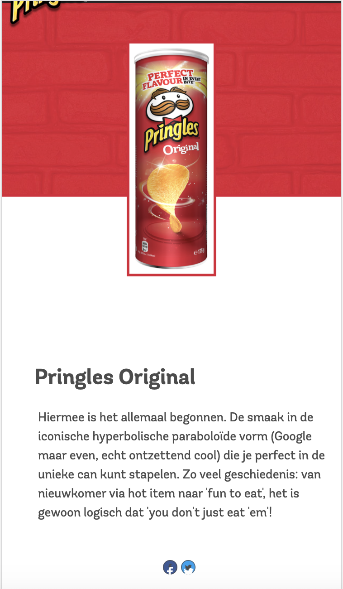

# Procesverslag
**Auteur:** Carmen Rozendaal

## Bronnenlijst
1. -bron 1: Pringles website, via https://www.pringles.com/nl/home.html. Geraadpleegd op 01-09-2020-
2. -bron 2- Markdown cheat cheet, via https://github.com/adam-p/markdown-here/wiki/Markdown-Cheatsheet
3. -...-

## Eindgesprek (week 7/8)

-dit ging goed & dit was lastig-

**Screenshot(s):**

-screenshot(s) van je eindresultaat-

## Voortgang 3 (week 6)

-same as voortgang 1-

## Voortgang 2 (week 5)

-same as voortgang 1-

## Voortgang 1 (week 3)

### Stand van zaken
Ik ben deze week aan de slag gegaan met position> en flexbox> en heb ik een begin gemaakt aan het toepassen van javascript op de navigatie. 

Ik ben begonnen met het logo te positioneren op de goede plek, dit was nog best lastig aangezien daardoor alles ging verschuiven. Ik heb mijn klasgenoot Danny uiteindelijk om hulp gevraagd aangezien hij in zijn Lays-site hetzelfde principe moest doen met het logo.

Vervolgens ben ik de producten met bijbehorende titels op een rij gaan zetten door flexbox> te gebruiken. Dit ging ook niet gelijk goed. De producten werden heel erg klein en waren niet gelijk in grootte, deze heb ik in Photoshop gelijk moeten trekken omdat de uitsnede van de originele foto's niet goed bleek te zijn.
Ook had ik in html alle producten achter elkaar gezet in een list>, dit bleek niet de beste oplossing dus heb ik inplaats daarvan de producten per rij in een list> gezet. Dit werkte goed en nu staan ook alle producten op een rij, alleen de tekst werkt niet goed mee... Bij de footer heb ik ook flexbox> gebruikt.

Tot slot heb ik voor de navigatie ook nog flexbox> gebruikt zodat de elementen op een rij bovenaan de pagina kwamen te staan, vervolgens heb ik het hamburger icoontje toegevoegd door gebruik te maken van position> Javascript is me helaas niet gelukt deze week.

**Screenshot(s):**

### Agenda voor meeting
1. Navigatiemenu Hamburger 'uiklappen' -> Pijltjes uitklapbalk 
2. Flexbox toepassen op tekst onder afbeelding. 
3. Icoontjes in navigatiebalk
4. eigen issues: Pringles Cans + tekst beter centreren 
5. eigen issue: Logo + Cans + tekst schalen en responsive 

### Verslag van meeting

-na afloop snel uitkomsten vastleggen-

## Proces (Week 2)
Ik ben deze week aan de slag gegaan met het plaatsen van alle content in de html en het toepassen van css op de tekst. Ook heb ik alvast een klein stukje layout gedaan.

Wat ging goed?
Ondansk dat ik het lastig vond om de code van de site te lezen, kon ik alle content goed verzamalen en plaatsen. Het scheelde dat ik de basisvaardigheden van html/css nog wist. Ik was achteraf best tevreden over het resultaat.

Wat ging minder goed?
Het lettertype dat door Pringles wordt gebruikt is een betaald lettertype, ik heb daarom een soortgelijk lettertype moeten zoeken op GoogleFonts/Dafont, dit koste wat tijd. Er stonden behoorlijk wat producten op de pagina en deze waren allemaal verschillend qwa grootte, dit was beetje vervelend betreft layout.

**Screenshot(s):**

**Vimeo link naar video resultaat week 2:** https://vimeo.com/458704175/c16d242628)

## Intake (week 1)

**Je startniveau:** Blauw

**Je focus:** Surface plane

**Je opdracht:** https://www.pringles.com/nl/home.html

* Ik heb voor Pringles gekozen omdat ik een echte chips-liefhebber ben, verder is het een leuk onderwerp om de komende tijd aan te werken.

* De huidige site van Pringles is nodig toe aan verbetering omdat hij niet zo van deze tijd is, zo bevat het weinig animaties en is er niet veel gedaan aan de vormgeving. Ik wil leren hoe je o.a interacties kunt toepassen op een site dus daarom was de site van Pringles erg geschikt. 

**Screenshot(s) huidige pagina's:**

**Breakdown-schets(en):**

