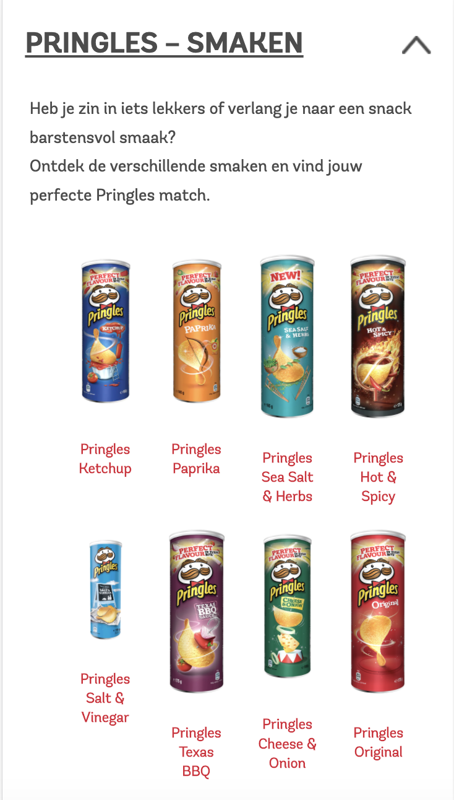

# Procesverslag
**Auteur:** Carmen Rozendaal

Markdown cheat cheet: [Hulp bij het schrijven van Markdown](https://github.com/adam-p/markdown-here/wiki/Markdown-Cheatsheet). Nb. de standaardstructuur en de spartaanse opmaak zijn helemaal prima. Het gaat om de inhoud van je procesverslag. Besteedt de tijd voor pracht en praal aan je website.

## Bronnenlijst
1. -bron 1: Pringles website, via https://www.pringles.com/nl/home.html. Geraadpleegd op 01-09-2020-
2. -bron 2-
3. -...-

## Eindgesprek (week 7/8)

-dit ging goed & dit was lastig-

**Screenshot(s):**

-screenshot(s) van je eindresultaat-

## Voortgang 3 (week 6)

-same as voortgang 1-

## Voortgang 2 (week 5)

-same as voortgang 1-

## Voortgang 1 (week 3)

### Stand van zaken

-dit ging goed & dit was lastig-

**Screenshot(s):**

-screenshot(s) van hoe ver je bent-

### Agenda voor meeting

-samen met je groepje opstellen-

### Verslag van meeting

-na afloop snel uitkomsten vastleggen-

## Intake (week 1)

**Je startniveau:** Blauw

**Je focus:** Surface plane

**Je opdracht:** https://www.pringles.com/uk/home.html

⋅⋅* Ik heb voor Pringles gekozen omdat ik een echte chips-liefhebber ben, verder is het een leuk onderwerp om de komende tijd aan te werken.
⋅⋅* De huidige site van Pringles is nodig toe aan verbetering omdat hij niet zo van deze tij is, zo bevat het weinig animaties en is er niet veel gedaan aan de vormgeving. Ik wil leren hoe je o.a interacties kunt toepassen op een site dus daarom was de site van Pringles erg geschikt. 

**Screenshot(s):**

**Breakdown-schets(en):**

